# Weight Coach - Database Design

> Comprehensive database schema for the AI-powered nutrition coach
> Last Updated: 2025-11-18

## Overview

This document describes the PostgreSQL database schema for Weight Coach, designed to support:
- User authentication and profiles
- Meal logging and nutrition tracking
- Inventory management (pantry/fridge items)
- Recipe storage and recommendations
- Meal planning (daily/weekly)
- Grocery list generation
- Dietary preferences and restrictions
- Activity logging and audit trails

## Design Principles

1. **Normalization**: Minimize data redundancy while maintaining performance
2. **Soft Deletes**: Use `deleted_at` for important data (users, meals, recipes)
3. **Timestamps**: All tables have `created_at` and `updated_at`
4. **Indexes**: Strategic indexes on frequently queried fields (user_id, dates, expiration)
5. **JSONB**: Flexible fields for nutrition data, AI responses, metadata
6. **Foreign Keys**: Enforce referential integrity with CASCADE/SET NULL as appropriate
7. **Async Support**: Designed for SQLAlchemy 2.0 async/await patterns

---

## Entity Relationship Diagram

```mermaid
erDiagram
    users ||--o{ user_profiles : has
    users ||--o{ meals : logs
    users ||--o{ inventory_items : owns
    users ||--o{ recipes : creates
    users ||--o{ user_recipes : saves
    users ||--o{ meal_plans : creates
    users ||--o{ grocery_lists : creates
    users ||--o{ user_goals : sets
    users ||--o{ activity_logs : generates

    meals ||--o{ meal_items : contains
    meals ||--o| ai_analyses : has

    recipes ||--o{ recipe_ingredients : requires
    recipes ||--o{ recipe_instructions : contains
    recipes ||--o{ user_recipes : saved_by
    recipes ||--o{ meal_plan_items : scheduled_in

    meal_plans ||--o{ meal_plan_items : contains

    grocery_lists ||--o{ grocery_list_items : contains

    inventory_items }o--|| food_categories : belongs_to
    recipe_ingredients }o--|| food_categories : belongs_to
    grocery_list_items }o--|| food_categories : belongs_to

    users {
        int id PK
        string email UK
        string hashed_password
        boolean is_active
        boolean is_verified
        timestamp created_at
        timestamp updated_at
        timestamp deleted_at
    }

    user_profiles {
        int id PK
        int user_id FK
        string full_name
        date date_of_birth
        string gender
        decimal height_cm
        decimal current_weight_kg
        string activity_level
        jsonb dietary_restrictions
        jsonb allergies
        jsonb preferences
        timestamp created_at
        timestamp updated_at
    }

    user_goals {
        int id PK
        int user_id FK
        string goal_type
        decimal target_weight_kg
        int target_calories
        jsonb macro_targets
        date start_date
        date target_date
        string status
        timestamp created_at
        timestamp updated_at
    }

    meals {
        int id PK
        int user_id FK
        string name
        string meal_type
        text description
        timestamp consumed_at
        string input_method
        string image_url
        text voice_transcript
        decimal total_calories
        jsonb macros
        jsonb micronutrients
        timestamp created_at
        timestamp updated_at
        timestamp deleted_at
    }

    meal_items {
        int id PK
        int meal_id FK
        string food_name
        decimal quantity
        string unit
        decimal calories
        jsonb nutrition_data
        timestamp created_at
    }

    ai_analyses {
        int id PK
        int meal_id FK
        text analysis
        text recommendations
        jsonb nutrition_breakdown
        decimal confidence_score
        string model_version
        timestamp created_at
    }

    food_categories {
        int id PK
        string name UK
        string description
        string icon
        timestamp created_at
        timestamp updated_at
    }

    inventory_items {
        int id PK
        int user_id FK
        int category_id FK
        string name
        decimal quantity
        string unit
        date expiration_date
        string storage_location
        string barcode
        jsonb nutrition_per_unit
        timestamp created_at
        timestamp updated_at
        timestamp deleted_at
    }

    recipes {
        int id PK
        int user_id FK
        string name
        text description
        int prep_time_minutes
        int cook_time_minutes
        int servings
        string difficulty
        string image_url
        decimal calories_per_serving
        jsonb macros_per_serving
        boolean is_public
        int views_count
        int saves_count
        timestamp created_at
        timestamp updated_at
        timestamp deleted_at
    }

    recipe_ingredients {
        int id PK
        int recipe_id FK
        int category_id FK
        string ingredient_name
        decimal quantity
        string unit
        boolean is_optional
        int order_index
        timestamp created_at
    }

    recipe_instructions {
        int id PK
        int recipe_id FK
        int step_number
        text instruction
        int duration_minutes
        string image_url
        timestamp created_at
    }

    user_recipes {
        int id PK
        int user_id FK
        int recipe_id FK
        text notes
        int rating
        timestamp created_at
    }

    meal_plans {
        int id PK
        int user_id FK
        string name
        date start_date
        date end_date
        int target_calories
        jsonb macro_targets
        string status
        timestamp created_at
        timestamp updated_at
    }

    meal_plan_items {
        int id PK
        int meal_plan_id FK
        int recipe_id FK
        date scheduled_date
        string meal_type
        int servings
        text notes
        boolean is_completed
        timestamp created_at
        timestamp updated_at
    }

    grocery_lists {
        int id PK
        int user_id FK
        int meal_plan_id FK
        string name
        string status
        timestamp created_at
        timestamp updated_at
    }

    grocery_list_items {
        int id PK
        int grocery_list_id FK
        int category_id FK
        string item_name
        decimal quantity
        string unit
        boolean is_checked
        decimal estimated_price
        text notes
        int order_index
        timestamp created_at
        timestamp updated_at
    }

    activity_logs {
        int id PK
        int user_id FK
        string activity_type
        string entity_type
        int entity_id
        jsonb changes
        string ip_address
        timestamp created_at
    }
```



---

## Table Specifications

### 1. users
**Purpose**: Core authentication and user management

| Column | Type | Constraints | Description |
|--------|------|-------------|-------------|
| id | SERIAL | PRIMARY KEY | Auto-incrementing user ID |
| email | VARCHAR(255) | UNIQUE, NOT NULL | User email (lowercase) |
| hashed_password | VARCHAR(255) | NOT NULL | Bcrypt hashed password |
| is_active | BOOLEAN | DEFAULT TRUE | Account active status |
| is_verified | BOOLEAN | DEFAULT FALSE | Email verification status |
| created_at | TIMESTAMP | DEFAULT NOW() | Account creation time |
| updated_at | TIMESTAMP | DEFAULT NOW() | Last update time |
| deleted_at | TIMESTAMP | NULL | Soft delete timestamp |

**Indexes**:
- `idx_users_email` on `email` (unique, for login lookups)
- `idx_users_deleted_at` on `deleted_at` (for filtering active users)

**Notes**:
- Email should be normalized to lowercase
- Use bcrypt with minimum 12 rounds for password hashing
- Soft delete preserves user data for audit purposes

---

### 2. user_profiles
**Purpose**: Extended user information and preferences

| Column | Type | Constraints | Description |
|--------|------|-------------|-------------|
| id | SERIAL | PRIMARY KEY | Profile ID |
| user_id | INTEGER | FOREIGN KEY, UNIQUE, NOT NULL | References users(id) |
| full_name | VARCHAR(255) | NULL | User's full name |
| date_of_birth | DATE | NULL | For age-based recommendations |
| gender | VARCHAR(20) | NULL | M/F/Other/Prefer not to say |
| height_cm | DECIMAL(5,2) | NULL | Height in centimeters |
| current_weight_kg | DECIMAL(5,2) | NULL | Current weight in kg |
| activity_level | VARCHAR(50) | NULL | sedentary/light/moderate/active/very_active |
| dietary_restrictions | JSONB | DEFAULT '[]' | ["vegetarian", "vegan", "keto", etc.] |
| allergies | JSONB | DEFAULT '[]' | ["peanuts", "shellfish", etc.] |
| preferences | JSONB | DEFAULT '{}' | Flexible preferences object |
| created_at | TIMESTAMP | DEFAULT NOW() | Profile creation time |
| updated_at | TIMESTAMP | DEFAULT NOW() | Last update time |

**Indexes**:
- `idx_user_profiles_user_id` on `user_id` (one-to-one lookup)

**JSONB Examples**:
```json
// dietary_restrictions
["vegetarian", "gluten_free", "low_carb"]

// allergies
["peanuts", "shellfish", "dairy"]

// preferences
{
  "cuisine_preferences": ["italian", "japanese", "mexican"],
  "cooking_skill": "intermediate",
  "meal_prep_time": "30-45min",
  "spice_tolerance": "medium"
}
```

---

### 3. user_goals
**Purpose**: Track user health and fitness goals

| Column | Type | Constraints | Description |
|--------|------|-------------|-------------|
| id | SERIAL | PRIMARY KEY | Goal ID |
| user_id | INTEGER | FOREIGN KEY, NOT NULL | References users(id) |
| goal_type | VARCHAR(50) | NOT NULL | weight_loss/weight_gain/maintain/muscle_gain |
| target_weight_kg | DECIMAL(5,2) | NULL | Target weight |
| target_calories | INTEGER | NULL | Daily calorie target |
| macro_targets | JSONB | NULL | {"protein": 150, "carbs": 200, "fat": 50} |
| start_date | DATE | NOT NULL | Goal start date |
| target_date | DATE | NULL | Expected completion date |
| status | VARCHAR(20) | DEFAULT 'active' | active/completed/paused/abandoned |
| created_at | TIMESTAMP | DEFAULT NOW() | Goal creation time |
| updated_at | TIMESTAMP | DEFAULT NOW() | Last update time |

**Indexes**:
- `idx_user_goals_user_id` on `user_id`
- `idx_user_goals_status` on `status` (for active goals)

---

### 4. meals
**Purpose**: Log user meals and consumption

| Column | Type | Constraints | Description |
|--------|------|-------------|-------------|
| id | SERIAL | PRIMARY KEY | Meal ID |
| user_id | INTEGER | FOREIGN KEY, NOT NULL | References users(id) CASCADE |
| name | VARCHAR(255) | NOT NULL | Meal name/title |
| meal_type | VARCHAR(50) | NULL | breakfast/lunch/dinner/snack |
| description | TEXT | NULL | User-provided description |
| consumed_at | TIMESTAMP | NOT NULL | When meal was eaten |
| input_method | VARCHAR(20) | NOT NULL | text/voice/image |
| image_url | TEXT | NULL | S3/CDN URL for meal photo |
| voice_transcript | TEXT | NULL | Whisper transcription |
| total_calories | DECIMAL(7,2) | NULL | Total calories |
| macros | JSONB | NULL | {"protein": 30, "carbs": 50, "fat": 20} |
| micronutrients | JSONB | NULL | Vitamins, minerals data |
| created_at | TIMESTAMP | DEFAULT NOW() | Record creation time |
| updated_at | TIMESTAMP | DEFAULT NOW() | Last update time |
| deleted_at | TIMESTAMP | NULL | Soft delete timestamp |

**Indexes**:
- `idx_meals_user_id` on `user_id`
- `idx_meals_consumed_at` on `consumed_at` (for date range queries)
- `idx_meals_user_consumed` on `(user_id, consumed_at DESC)` (composite, for user timeline)

**Notes**:
- `consumed_at` is user's local time (store timezone separately if needed)
- `input_method` tracks how meal was logged (for analytics)

---

### 5. meal_items
**Purpose**: Individual food items within a meal

| Column | Type | Constraints | Description |
|--------|------|-------------|-------------|
| id | SERIAL | PRIMARY KEY | Item ID |
| meal_id | INTEGER | FOREIGN KEY, NOT NULL | References meals(id) CASCADE |
| food_name | VARCHAR(255) | NOT NULL | Food item name |
| quantity | DECIMAL(8,2) | NOT NULL | Amount consumed |
| unit | VARCHAR(50) | NOT NULL | g/oz/cup/piece/serving |
| calories | DECIMAL(7,2) | NULL | Calories for this item |
| nutrition_data | JSONB | NULL | Detailed nutrition breakdown |
| created_at | TIMESTAMP | DEFAULT NOW() | Item creation time |

**Indexes**:
- `idx_meal_items_meal_id` on `meal_id`

**JSONB Example**:
```json
// nutrition_data
{
  "protein": 25.5,
  "carbs": 30.2,
  "fat": 10.5,
  "fiber": 5.2,
  "sugar": 2.1,
  "sodium": 300,
  "vitamins": {
    "vitamin_c": 15,
    "vitamin_d": 2
  }
}
```

---

### 6. ai_analyses
**Purpose**: Store AI-generated nutrition insights

| Column | Type | Constraints | Description |
|--------|------|-------------|-------------|
| id | SERIAL | PRIMARY KEY | Analysis ID |
| meal_id | INTEGER | FOREIGN KEY, UNIQUE, NOT NULL | References meals(id) CASCADE |
| analysis | TEXT | NULL | GPT-4 nutrition analysis |
| recommendations | TEXT | NULL | Personalized suggestions |
| nutrition_breakdown | JSONB | NULL | Structured nutrition data |
| confidence_score | DECIMAL(3,2) | NULL | AI confidence (0.00-1.00) |
| model_version | VARCHAR(50) | NULL | e.g., "gpt-4-1106-preview" |
| created_at | TIMESTAMP | DEFAULT NOW() | Analysis timestamp |

**Indexes**:
- `idx_ai_analyses_meal_id` on `meal_id` (unique, one-to-one)

**Notes**:
- Cache AI responses to avoid redundant API calls
- Store model version for reproducibility and debugging

---

### 7. food_categories
**Purpose**: Categorize foods for organization and filtering

| Column | Type | Constraints | Description |
|--------|------|-------------|-------------|
| id | SERIAL | PRIMARY KEY | Category ID |
| name | VARCHAR(100) | UNIQUE, NOT NULL | Category name |
| description | TEXT | NULL | Category description |
| icon | VARCHAR(50) | NULL | Icon identifier (e.g., emoji or icon name) |
| created_at | TIMESTAMP | DEFAULT NOW() | Category creation time |
| updated_at | TIMESTAMP | DEFAULT NOW() | Last update time |

**Indexes**:
- `idx_food_categories_name` on `name` (unique)

**Sample Categories**:
- Fruits, Vegetables, Grains, Proteins, Dairy, Snacks, Beverages, Condiments, etc.

---

### 8. inventory_items
**Purpose**: Track user's pantry/fridge inventory

| Column | Type | Constraints | Description |
|--------|------|-------------|-------------|
| id | SERIAL | PRIMARY KEY | Inventory item ID |
| user_id | INTEGER | FOREIGN KEY, NOT NULL | References users(id) CASCADE |
| category_id | INTEGER | FOREIGN KEY, NULL | References food_categories(id) SET NULL |
| name | VARCHAR(255) | NOT NULL | Item name |
| quantity | DECIMAL(8,2) | NOT NULL | Current quantity |
| unit | VARCHAR(50) | NOT NULL | g/oz/L/pieces |
| expiration_date | DATE | NULL | Expiration date |
| storage_location | VARCHAR(50) | NULL | pantry/fridge/freezer |
| barcode | VARCHAR(100) | NULL | For barcode scanning |
| nutrition_per_unit | JSONB | NULL | Nutrition per unit quantity |
| created_at | TIMESTAMP | DEFAULT NOW() | Item added time |
| updated_at | TIMESTAMP | DEFAULT NOW() | Last update time |
| deleted_at | TIMESTAMP | NULL | Soft delete timestamp |

**Indexes**:
- `idx_inventory_user_id` on `user_id`
- `idx_inventory_expiration` on `expiration_date` (for expiring soon queries)
- `idx_inventory_user_expiration` on `(user_id, expiration_date)` (composite)

**Notes**:
- `expiration_date` index enables "expiring soon" notifications
- `storage_location` helps organize inventory by location

---

### 9. recipes
**Purpose**: Store recipes (user-created or curated)

| Column | Type | Constraints | Description |
|--------|------|-------------|-------------|
| id | SERIAL | PRIMARY KEY | Recipe ID |
| user_id | INTEGER | FOREIGN KEY, NULL | References users(id) SET NULL (NULL = system recipe) |
| name | VARCHAR(255) | NOT NULL | Recipe name |
| description | TEXT | NULL | Recipe description |
| prep_time_minutes | INTEGER | NULL | Preparation time |
| cook_time_minutes | INTEGER | NULL | Cooking time |
| servings | INTEGER | NOT NULL | Number of servings |
| difficulty | VARCHAR(20) | NULL | easy/medium/hard |
| image_url | TEXT | NULL | Recipe image URL |
| calories_per_serving | DECIMAL(7,2) | NULL | Calories per serving |
| macros_per_serving | JSONB | NULL | Macros per serving |
| is_public | BOOLEAN | DEFAULT FALSE | Public/private recipe |
| views_count | INTEGER | DEFAULT 0 | View count |
| saves_count | INTEGER | DEFAULT 0 | Save count |
| created_at | TIMESTAMP | DEFAULT NOW() | Recipe creation time |
| updated_at | TIMESTAMP | DEFAULT NOW() | Last update time |
| deleted_at | TIMESTAMP | NULL | Soft delete timestamp |

**Indexes**:
- `idx_recipes_user_id` on `user_id`
- `idx_recipes_is_public` on `is_public` (for public recipe queries)
- `idx_recipes_saves_count` on `saves_count DESC` (for popular recipes)

---

### 10. recipe_ingredients
**Purpose**: Ingredients required for recipes

| Column | Type | Constraints | Description |
|--------|------|-------------|-------------|
| id | SERIAL | PRIMARY KEY | Ingredient ID |
| recipe_id | INTEGER | FOREIGN KEY, NOT NULL | References recipes(id) CASCADE |
| category_id | INTEGER | FOREIGN KEY, NULL | References food_categories(id) SET NULL |
| ingredient_name | VARCHAR(255) | NOT NULL | Ingredient name |
| quantity | DECIMAL(8,2) | NOT NULL | Amount needed |
| unit | VARCHAR(50) | NOT NULL | g/oz/cup/tbsp |
| is_optional | BOOLEAN | DEFAULT FALSE | Optional ingredient |
| order_index | INTEGER | NOT NULL | Display order |
| created_at | TIMESTAMP | DEFAULT NOW() | Creation time |

**Indexes**:
- `idx_recipe_ingredients_recipe_id` on `recipe_id`
- `idx_recipe_ingredients_order` on `(recipe_id, order_index)` (for ordered display)

---

### 11. recipe_instructions
**Purpose**: Step-by-step cooking instructions

| Column | Type | Constraints | Description |
|--------|------|-------------|-------------|
| id | SERIAL | PRIMARY KEY | Instruction ID |
| recipe_id | INTEGER | FOREIGN KEY, NOT NULL | References recipes(id) CASCADE |
| step_number | INTEGER | NOT NULL | Step order |
| instruction | TEXT | NOT NULL | Instruction text |
| duration_minutes | INTEGER | NULL | Time for this step |
| image_url | TEXT | NULL | Step image URL |
| created_at | TIMESTAMP | DEFAULT NOW() | Creation time |

**Indexes**:
- `idx_recipe_instructions_recipe` on `(recipe_id, step_number)` (for ordered retrieval)

---

### 12. user_recipes
**Purpose**: User-saved/favorited recipes with ratings

| Column | Type | Constraints | Description |
|--------|------|-------------|-------------|
| id | SERIAL | PRIMARY KEY | Record ID |
| user_id | INTEGER | FOREIGN KEY, NOT NULL | References users(id) CASCADE |
| recipe_id | INTEGER | FOREIGN KEY, NOT NULL | References recipes(id) CASCADE |
| notes | TEXT | NULL | User's personal notes |
| rating | INTEGER | NULL | Rating 1-5 |
| created_at | TIMESTAMP | DEFAULT NOW() | Saved timestamp |

**Indexes**:
- `idx_user_recipes_user_id` on `user_id`
- `idx_user_recipes_unique` on `(user_id, recipe_id)` (unique constraint)

**Constraints**:
- UNIQUE constraint on `(user_id, recipe_id)` - user can't save same recipe twice
- CHECK constraint: `rating BETWEEN 1 AND 5`

---

### 13. meal_plans
**Purpose**: Weekly/daily meal planning

| Column | Type | Constraints | Description |
|--------|------|-------------|-------------|
| id | SERIAL | PRIMARY KEY | Meal plan ID |
| user_id | INTEGER | FOREIGN KEY, NOT NULL | References users(id) CASCADE |
| name | VARCHAR(255) | NOT NULL | Plan name |
| start_date | DATE | NOT NULL | Plan start date |
| end_date | DATE | NOT NULL | Plan end date |
| target_calories | INTEGER | NULL | Daily calorie target |
| macro_targets | JSONB | NULL | Daily macro targets |
| status | VARCHAR(20) | DEFAULT 'active' | active/completed/archived |
| created_at | TIMESTAMP | DEFAULT NOW() | Plan creation time |
| updated_at | TIMESTAMP | DEFAULT NOW() | Last update time |

**Indexes**:
- `idx_meal_plans_user_id` on `user_id`
- `idx_meal_plans_dates` on `(user_id, start_date, end_date)` (for date range queries)

---

### 14. meal_plan_items
**Purpose**: Individual meals scheduled in meal plans

| Column | Type | Constraints | Description |
|--------|------|-------------|-------------|
| id | SERIAL | PRIMARY KEY | Item ID |
| meal_plan_id | INTEGER | FOREIGN KEY, NOT NULL | References meal_plans(id) CASCADE |
| recipe_id | INTEGER | FOREIGN KEY, NULL | References recipes(id) SET NULL |
| scheduled_date | DATE | NOT NULL | Date scheduled |
| meal_type | VARCHAR(50) | NOT NULL | breakfast/lunch/dinner/snack |
| servings | INTEGER | DEFAULT 1 | Number of servings |
| notes | TEXT | NULL | Meal-specific notes |
| is_completed | BOOLEAN | DEFAULT FALSE | Meal consumed |
| created_at | TIMESTAMP | DEFAULT NOW() | Creation time |
| updated_at | TIMESTAMP | DEFAULT NOW() | Last update time |

**Indexes**:
- `idx_meal_plan_items_plan_id` on `meal_plan_id`
- `idx_meal_plan_items_schedule` on `(meal_plan_id, scheduled_date, meal_type)`

---

### 15. grocery_lists
**Purpose**: Shopping lists (auto-generated or manual)

| Column | Type | Constraints | Description |
|--------|------|-------------|-------------|
| id | SERIAL | PRIMARY KEY | List ID |
| user_id | INTEGER | FOREIGN KEY, NOT NULL | References users(id) CASCADE |
| meal_plan_id | INTEGER | FOREIGN KEY, NULL | References meal_plans(id) SET NULL |
| name | VARCHAR(255) | NOT NULL | List name |
| status | VARCHAR(20) | DEFAULT 'active' | active/completed/archived |
| created_at | TIMESTAMP | DEFAULT NOW() | List creation time |
| updated_at | TIMESTAMP | DEFAULT NOW() | Last update time |

**Indexes**:
- `idx_grocery_lists_user_id` on `user_id`
- `idx_grocery_lists_meal_plan` on `meal_plan_id`

---

### 16. grocery_list_items
**Purpose**: Individual items in grocery lists

| Column | Type | Constraints | Description |
|--------|------|-------------|-------------|
| id | SERIAL | PRIMARY KEY | Item ID |
| grocery_list_id | INTEGER | FOREIGN KEY, NOT NULL | References grocery_lists(id) CASCADE |
| category_id | INTEGER | FOREIGN KEY, NULL | References food_categories(id) SET NULL |
| item_name | VARCHAR(255) | NOT NULL | Item name |
| quantity | DECIMAL(8,2) | NOT NULL | Quantity to buy |
| unit | VARCHAR(50) | NOT NULL | g/oz/L/pieces |
| is_checked | BOOLEAN | DEFAULT FALSE | Item purchased |
| estimated_price | DECIMAL(8,2) | NULL | Estimated price |
| notes | TEXT | NULL | Item-specific notes |
| order_index | INTEGER | NOT NULL | Display order |
| created_at | TIMESTAMP | DEFAULT NOW() | Creation time |
| updated_at | TIMESTAMP | DEFAULT NOW() | Last update time |

**Indexes**:
- `idx_grocery_list_items_list_id` on `grocery_list_id`
- `idx_grocery_list_items_category` on `category_id` (for grouping by category)

---

### 17. activity_logs
**Purpose**: Audit trail for user actions

| Column | Type | Constraints | Description |
|--------|------|-------------|-------------|
| id | SERIAL | PRIMARY KEY | Log ID |
| user_id | INTEGER | FOREIGN KEY, NULL | References users(id) SET NULL |
| activity_type | VARCHAR(50) | NOT NULL | create/update/delete/login |
| entity_type | VARCHAR(50) | NOT NULL | meal/recipe/inventory_item/etc. |
| entity_id | INTEGER | NULL | ID of affected entity |
| changes | JSONB | NULL | Before/after data |
| ip_address | VARCHAR(45) | NULL | User IP (IPv6 compatible) |
| created_at | TIMESTAMP | DEFAULT NOW() | Activity timestamp |

**Indexes**:
- `idx_activity_logs_user_id` on `user_id`
- `idx_activity_logs_created_at` on `created_at DESC` (for recent activity)
- `idx_activity_logs_entity` on `(entity_type, entity_id)` (for entity history)

**JSONB Example**:
```json
// changes
{
  "before": {"quantity": 500, "unit": "g"},
  "after": {"quantity": 250, "unit": "g"}
}
```

---

## Database Constraints Summary

### Foreign Key Relationships

| Child Table | Parent Table | Constraint | On Delete |
|-------------|--------------|------------|-----------|
| user_profiles | users | user_id | CASCADE |
| user_goals | users | user_id | CASCADE |
| meals | users | user_id | CASCADE |
| meal_items | meals | meal_id | CASCADE |
| ai_analyses | meals | meal_id | CASCADE |
| inventory_items | users | user_id | CASCADE |
| inventory_items | food_categories | category_id | SET NULL |
| recipes | users | user_id | SET NULL |
| recipe_ingredients | recipes | recipe_id | CASCADE |
| recipe_ingredients | food_categories | category_id | SET NULL |
| recipe_instructions | recipes | recipe_id | CASCADE |
| user_recipes | users | user_id | CASCADE |
| user_recipes | recipes | recipe_id | CASCADE |
| meal_plans | users | user_id | CASCADE |
| meal_plan_items | meal_plans | meal_plan_id | CASCADE |
| meal_plan_items | recipes | recipe_id | SET NULL |
| grocery_lists | users | user_id | CASCADE |
| grocery_lists | meal_plans | meal_plan_id | SET NULL |
| grocery_list_items | grocery_lists | grocery_list_id | CASCADE |
| grocery_list_items | food_categories | category_id | SET NULL |
| activity_logs | users | user_id | SET NULL |

### Unique Constraints

- `users.email` - Ensure unique email addresses
- `user_profiles.user_id` - One profile per user
- `food_categories.name` - Unique category names
- `ai_analyses.meal_id` - One analysis per meal
- `user_recipes(user_id, recipe_id)` - Can't save same recipe twice

### Check Constraints

- `user_recipes.rating` - CHECK (rating BETWEEN 1 AND 5)
- `inventory_items.quantity` - CHECK (quantity >= 0)
- `recipes.servings` - CHECK (servings > 0)
- `ai_analyses.confidence_score` - CHECK (confidence_score BETWEEN 0 AND 1)

---

## Performance Optimization

### Index Strategy

**High-Priority Indexes** (for frequently accessed queries):
1. User lookups: `users(email)`, `user_profiles(user_id)`
2. Meal history: `meals(user_id, consumed_at DESC)`
3. Expiring inventory: `inventory_items(user_id, expiration_date)`
4. Active meal plans: `meal_plans(user_id, status)`
5. Recipe discovery: `recipes(is_public, saves_count DESC)`

**Composite Indexes** (for multi-column queries):
- `(user_id, consumed_at)` on meals - User's meal timeline
- `(user_id, expiration_date)` on inventory_items - User's expiring items
- `(recipe_id, order_index)` on recipe_ingredients - Ordered ingredient list
- `(meal_plan_id, scheduled_date, meal_type)` on meal_plan_items - Daily meal view

### JSONB Indexing (Optional)

For frequently queried JSONB fields, add GIN indexes:
```sql
CREATE INDEX idx_user_profiles_dietary_restrictions ON user_profiles USING GIN (dietary_restrictions);
CREATE INDEX idx_meals_macros ON meals USING GIN (macros);
```

---

## Migration Strategy

### Phase 1: Core MVP (Day 1)
Essential tables for basic functionality:
1. users
2. user_profiles
3. user_goals
4. meals
5. meal_items
6. ai_analyses
7. food_categories

### Phase 2: Extended Features (Day 2)
Advanced features:
8. inventory_items
9. recipes
10. recipe_ingredients
11. recipe_instructions
12. user_recipes

### Phase 3: Planning & Lists (Day 3)
Planning and organization:
13. meal_plans
14. meal_plan_items
15. grocery_lists
16. grocery_list_items
17. activity_logs

---

## Sample Queries

### Get user's meals for today with nutrition
```sql
SELECT
  m.*,
  COALESCE(m.total_calories, SUM(mi.calories)) as total_calories
FROM meals m
LEFT JOIN meal_items mi ON m.id = mi.meal_id
WHERE m.user_id = $1
  AND m.consumed_at::date = CURRENT_DATE
  AND m.deleted_at IS NULL
GROUP BY m.id
ORDER BY m.consumed_at DESC;
```

### Find recipes user can make with current inventory
```sql
SELECT r.*,
  COUNT(ri.id) as total_ingredients,
  COUNT(ii.id) as available_ingredients
FROM recipes r
JOIN recipe_ingredients ri ON r.id = ri.recipe_id
LEFT JOIN inventory_items ii ON
  ii.user_id = $1
  AND ii.name ILIKE ri.ingredient_name
  AND ii.quantity >= ri.quantity
  AND ii.deleted_at IS NULL
WHERE r.is_public = TRUE OR r.user_id = $1
GROUP BY r.id
HAVING COUNT(ii.id) = COUNT(ri.id)  -- All ingredients available
ORDER BY r.saves_count DESC;
```

### Get items expiring in next 7 days
```sql
SELECT ii.*, fc.name as category_name
FROM inventory_items ii
LEFT JOIN food_categories fc ON ii.category_id = fc.id
WHERE ii.user_id = $1
  AND ii.deleted_at IS NULL
  AND ii.expiration_date BETWEEN CURRENT_DATE AND CURRENT_DATE + INTERVAL '7 days'
ORDER BY ii.expiration_date ASC;
```

### Generate grocery list from meal plan
```sql
SELECT
  ri.ingredient_name,
  SUM(ri.quantity * mpi.servings) as total_quantity,
  ri.unit,
  fc.name as category
FROM meal_plan_items mpi
JOIN recipe_ingredients ri ON mpi.recipe_id = ri.recipe_id
LEFT JOIN food_categories fc ON ri.category_id = fc.id
WHERE mpi.meal_plan_id = $1
  AND mpi.is_completed = FALSE
GROUP BY ri.ingredient_name, ri.unit, fc.name, fc.id
ORDER BY fc.name, ri.ingredient_name;
```

---

## Security Considerations

1. **Row-Level Security**: Implement PostgreSQL RLS policies to ensure users can only access their own data
2. **Password Hashing**: Always use bcrypt with minimum 12 rounds
3. **Soft Deletes**: Preserve data for audit purposes, filter with `deleted_at IS NULL`
4. **Activity Logging**: Track sensitive operations (login, profile changes, deletions)
5. **Input Validation**: Use Pydantic schemas to validate all inputs before DB insertion

---

## Backup & Maintenance

### Recommended Maintenance Tasks

1. **Daily**: Backup database
2. **Weekly**: Vacuum analyze high-write tables (meals, activity_logs)
3. **Monthly**: Archive old activity_logs (keep last 90 days)
4. **Quarterly**: Review and optimize slow queries

### Archive Strategy

For `activity_logs`, consider partitioning by month:
```sql
CREATE TABLE activity_logs_2025_01 PARTITION OF activity_logs
  FOR VALUES FROM ('2025-01-01') TO ('2025-02-01');
```

---

## Future Enhancements

Potential schema additions for future versions:

1. **Social Features**:
   - `user_followers` table for social connections
   - Comments and likes on recipes

2. **Advanced Nutrition**:
   - `nutrition_facts_database` table with comprehensive food data
   - Integration with USDA FoodData Central

3. **Gamification**:
   - `achievements` and `user_achievements` tables
   - `streaks` table for tracking consistency

4. **Integration**:
   - `connected_devices` for fitness trackers
   - `external_recipe_sources` for API integrations

---

**Next Steps**: Implement SQLAlchemy models, Pydantic schemas, and Alembic migrations based on this design.
