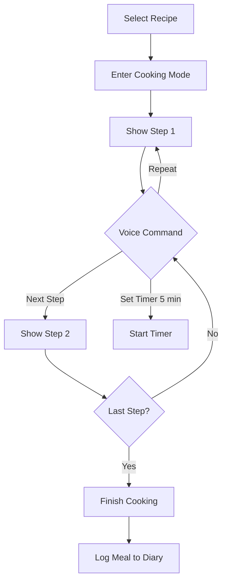

# User Flows

## 1. Onboarding Flow

```mermaid
graph TD
    A[Start] --> B[Sign Up / Login]
    B --> C{Has Profile?}
    C -- No --> D[Onboarding Wizard]
    D --> E[Input Basic Info (Age, Wt, Ht)]
    E --> F[Select Goals (Lose/Gain/Maintain)]
    F --> G[Select Dietary Restrictions]
    G --> H[Complete Profile]
    H --> I[Dashboard]
    C -- Yes --> I
```

## 2. Add Inventory (Manual/Voice/Camera)

```mermaid
graph TD
    A[Inventory Page] --> B{Choose Method}
    B -- Manual --> C[Click 'Add Item']
    C --> D[Fill Form]
    D --> E[Save]
    
    B -- Voice --> F[Click Mic Icon]
    F --> G[Speak Items e.g. 'Milk and Eggs']
    G --> H[Processing (Whisper)]
    H --> I[Confirm Extracted List]
    I --> E
    
    B -- Camera --> J[Click Camera Icon]
    J --> K[Take/Upload Photo]
    K --> L[Processing (Vision API)]
    L --> M[Confirm Identified Items]
    M --> E
```

## 3. Generate Meal Plan Flow

```mermaid
graph TD
    A[Meal Planner Page] --> B[Click 'Generate Plan']
    B --> C[Check Inventory & Preferences]
    C --> D[AI Generation (GPT-4)]
    D --> E[Present Weekly Plan]
    E --> F{User Happy?}
    F -- Yes --> G[Save Plan]
    F -- No --> H[Regenerate / Edit Specific Meals]
    H --> E
    G --> I[Update Shopping List]
```

## 4. Cooking with Voice Assistant



## 5. Shopping List Flow

```mermaid
graph TD
    A[Generate Meal Plan] --> B[Auto-generate Shopping List]
    B --> C[Review List]
    C --> D[Remove items already owned (if missed)]
    D --> E[Go Shopping]
    E --> F[Check off items]
    F --> G[Mark as 'Purchased']
    G --> H[Add to Inventory]
```
